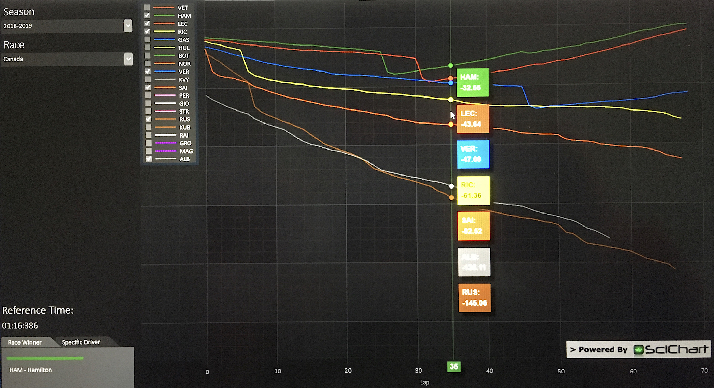

# Race Trace - Technical Exercise

A race trace is a visualisation that shows the cumulative time loss during a race, for all drivers, relative to a reference (typically the average lap time of the winner). This application loads data from the [Ergast Developer API](http://ergast.com/mrd/) and displays the resulting data in a C# WPF application.

